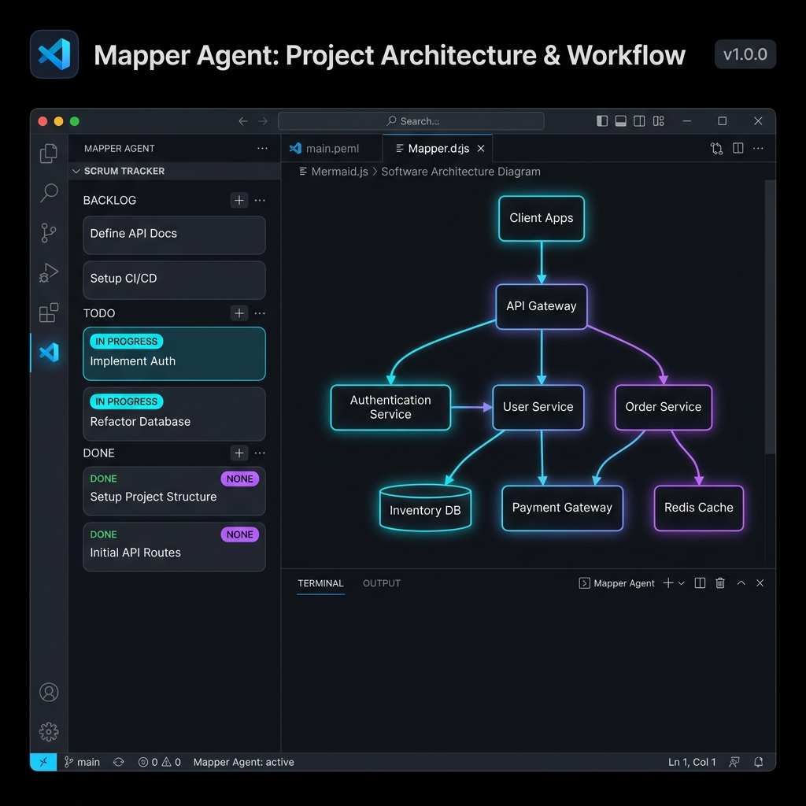
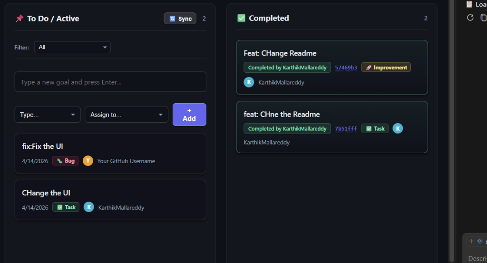

# Mapper
*The AI-powered architect and scrum master for your projects.*



Mapper is a Visual Studio Code extension designed to bring order to code chaos. By deeply analyzing your codebase via AST parsing and module resolution, and integrating directly with Google's Gemini 1.5 Pro AI, Mapper provides live, zoomable architecture visualizations and zero-friction project management using your local Git history.

## Features

### Live Architecture Visualization
Never get lost in a sprawling codebase again. Mapper deeply scans your files, categorizes your technical stack (Frontend, Backend, Database), and visualizes the relationships between your modules in a beautiful, zoomable, interactive Mermaid diagram directly in a Webview panel.




### AI Auto-Mapped Scrum Tracker
Project management natively inside your IDE. Create goals, assign them to team members, and keep track of your ticket types (Bug, Story, Task). 
**Zero-Friction Completion**: The proprietary AI Sync engine automatically scans your local git commit history. When it detects a commit that resolves a goal, it instantly maps the commit hash and moves the ticket to the "Completed" column.

### Contextual File Explanation
Beam any source file directly into your Copilot Chat. Mapper will analyze the file's role within your dependency tree and explain how it connects to the broader architecture.

### Markdown Exporting
Automatically generate an ARCHITECTURE.md file charting your entire project's module imports and symbols hierarchy, perfect for onboarding new developers.

## Quick Start

**1. Initialize the Visualizer**
- Open the Command Palette (Ctrl+Shift+P) or Chat panel (Ctrl+Alt+I).
- Run @mapper /draw.
- Provide your Gemini API Key when prompted.

**2. Explore Your Code**
- Click on any node in the generated diagram to jump to that file in your editor.
- Use the breadcrumb trails and trace tools to find references.

**3. Manage Tasks**
- Run @mapper /scrumtracker.
- Add tasks and assign them to your Git contributors.
- Click Sync after making a commit to watch the AI automatically resolve your tickets.

## Architecture
```text
┌─────────────────┐         ┌─────────────────┐
│  VS Code Editor │         │   Mapper Agent  │
│                 │         │                 │
│  Active Files   │         │  AST Parsing    │
│       ↓         │         │       ↓         │
│  Git History    │         │  Module Graph   │
└────────┬────────┘         └────────┬────────┘
         │                           │
         └──────────┬────────────────┘
                    │
           ┌────────▼────────┐
           │   Gemini API    │
           │  (Semantic Map) │
           └────────┬────────┘
                    │
           ┌────────▼────────┐
           │ Webview UI Core │
           │ Scrums & Graphs │
           └─────────────────┘
```

## Key Components

| Component | Purpose |
| :--- | :--- |
| symbolIndex.ts | AST Parsing and symbol extraction (classes, functions, interfaces). |
| moduleGraph.ts | Dependency resolution and Mermaid.js syntax generation. |
| scanCache.ts | Local caching of workspace scans to optimize performance. |
| scrum.json | Local offline storage for Kanban tickets and assignments. |
| detectScrumCompletions | AI prompt engine that maps .git logs to goal statuses. |
| frameworkDetectors.ts | Identifies technologies (React, Express, FastAPI) automatically. |

## Configuration

Mapper uses a transparent two-tier AI system for its Scrum completion engine. You always know which model is active — it is shown in your VS Code status bar every time a sync runs.

### Tier 1 — GitHub Copilot (GPT-4o): Zero Cost
If you have GitHub Copilot installed, Mapper will automatically use **GPT-4o** for all Scrum mapping. GPT-4o is classified as a "base model" under Copilot and consumes **zero Copilot credits** — it is completely free regardless of your Copilot plan tier. You do not need a Gemini key at all if Copilot is available.

When this mode is active, your status bar will show: `Mapper Scrum: Using GitHub Copilot (GPT-4o) — 0 credits used`

> **Note:** Mapper will only ever use GPT-4o from Copilot. It will never silently fall back to another Copilot model (like Claude or o1) that may consume credits. This is intentional to protect you from unexpected charges.

### Tier 2 — Gemini API (Free Key): No Copilot Required
If GitHub Copilot is not installed or GPT-4o is unavailable, Mapper falls back to Google's Gemini API. This requires a **personal API key**, which is completely free:
- Get your key at [Google AI Studio](https://aistudio.google.com/app/apikey) — no credit card required.
- Mapper runs entirely on Google's **free Gemini tier**. No billing plan is needed.
- The first time you run a command without Copilot, a secure input box will appear asking for your key. You only enter it once.
- Your key is stored in VS Code's **OS-level Secret Storage** vault — the same encrypted keychain that stores your GitHub tokens. It is never written to any file in your workspace.

When this mode is active, your status bar will show: `Mapper Scrum: Copilot GPT-4o not found, falling back to Gemini API`

To reset or update your Gemini key at any time, open the Command Palette (`Ctrl+Shift+P`) and run `Mapper: Reset Gemini API Key`.

## Privacy Model

- **Zero SaaS Lock-in**: All architecture caching (`.mapper/`) and Scrum goals (`scrum.json`) are stored natively on your local hard drive. No cloud database, no account, no sync server.
- **Your source code stays private**: Mapper never sends your raw source code to any external service. For visualizations, it sends only module names and import paths. For Scrum resolution, it sends only commit message subjects. Your actual business logic never leaves your machine.
- **Encrypted key storage**: Your Gemini API Key is stored in VS Code's native OS-level Secret Storage vault — the same encrypted keychain that stores your GitHub tokens and Azure credentials. It is never written to disk in plaintext.
- **Offline-first**: Architecture scans are cached locally. Once a scan is complete, you can view your diagrams and Scrum board without an internet connection.

## Development
```bash
# Install dependencies
npm install

# Watch mode (auto-rebuild)
npm run watch

# Production build
npm run compile

# Press F5 in VS Code to launch Extension Development Host
```

## License
MIT
